# Diagrama de Classes UML — Tarefa 7

> Gerado automaticamente a partir do código-fonte do projeto Flutter.

```mermaid
classDiagram
    direction TB

    %% ══════════════════════════════════════════
    %% CAMADA: Models
    %% ══════════════════════════════════════════
    namespace Models {
        class Product {
            +int id
            +String title
            +double price
            +String image
            +String description
            +String category
            +double rating
            +int ratingCount
            +Product.fromJson(Map json)$ Product
            +toJson() Map
        }
    }

    %% ══════════════════════════════════════════
    %% CAMADA: Services
    %% ══════════════════════════════════════════
    namespace Services {
        class ProductService {
            -String _baseUrl
            +fetchProducts() Future~List~Product~~
            +addProduct(Product p) Future~Product~
            +updateProduct(Product p) Future~Product~
            +deleteProduct(int id) Future~bool~
        }
    }

    %% ══════════════════════════════════════════
    %% CAMADA: Screens
    %% ══════════════════════════════════════════
    namespace Screens {
        class HomeScreen {
            <<StatelessWidget>>
            +build(BuildContext) Widget
        }

        class ProductListScreen {
            <<StatefulWidget>>
            +createState() State
        }

        class _ProductListScreenState {
            -ProductService _service
            -List~Product~ _products
            -bool _isLoading
            -String? _error
            +initState() void
            -_loadProducts() Future~void~
            +build(BuildContext) Widget
            -_buildBody() Widget
        }

        class ProductDetailScreen {
            <<StatelessWidget>>
            +Product product
            +build(BuildContext) Widget
            -_buildStars(double) Widget
            -_confirmarExclusao(BuildContext) Future~void~
        }

        class ProductFormScreen {
            <<StatefulWidget>>
            +Product? product
            +createState() State
        }

        class _ProductFormScreenState {
            -GlobalKey~FormState~ _formKey
            -ProductService _service
            -TextEditingController _titleController
            -TextEditingController _priceController
            -TextEditingController _descriptionController
            -TextEditingController _imageController
            -TextEditingController _categoryController
            -bool _isLoading
            +initState() void
            +dispose() void
            -_salvar() Future~void~
            +build(BuildContext) Widget
        }
    }

    %% ══════════════════════════════════════════
    %% CAMADA: Widgets
    %% ══════════════════════════════════════════
    namespace Widgets {
        class ProductCard {
            <<StatelessWidget>>
            +Product product
            +VoidCallback onTap
            +build(BuildContext) Widget
        }
    }

    %% ══════════════════════════════════════════
    %% FEATURE: Todos (Clean Architecture — intacta)
    %% ══════════════════════════════════════════
    namespace TodosDomain {
        class Todo {
            +int id
            +String title
            +bool completed
            +copyWith(...) Todo
        }

        class TodoFetchResult {
            +List~Todo~ todos
            +String? lastSyncLabel
        }

        class TodoRepository {
            <<abstract>>
            +fetchTodos(bool forceRefresh) Future~TodoFetchResult~
            +addTodo(String title) Future~Todo~
            +updateCompleted(int id, bool completed) Future~void~
        }
    }

    namespace TodosData {
        class TodoModel {
            +int id
            +String title
            +bool completed
            +TodoModel.fromJson(Map json)$ TodoModel
            +toJson() Map
        }

        class TodoRepositoryImpl {
            -TodoRemoteDataSource _remote
            -TodoLocalDataSource _local
            +fetchTodos(bool) Future~TodoFetchResult~
            +addTodo(String) Future~Todo~
            +updateCompleted(int,bool) Future~void~
        }

        class TodoRemoteDataSource {
            -String _baseUrl
            +fetchTodos() Future~List~TodoModel~~
            +addTodo(String) Future~TodoModel~
            +updateCompleted(int,bool) Future~void~
        }

        class TodoLocalDataSource {
            +saveLastSync(DateTime) Future~void~
            +getLastSync() Future~DateTime?~
        }
    }

    namespace TodosPresentation {
        class TodoViewModel {
            <<ChangeNotifier>>
            -TodoRepository _repo
            +bool isLoading
            +String? errorMessage
            +List~Todo~ items
            +String? lastSyncLabel
            +loadTodos(bool) Future~void~
            +addTodo(String) Future~void~
            +toggleCompleted(int,bool) Future~void~
        }

        class TodosPage {
            <<StatefulWidget>>
            +createState() State
        }

        class AddTodoDialog {
            <<StatelessWidget>>
            +build(BuildContext) Widget
        }
    }

    %% ══════════════════════════════════════════
    %% RELACIONAMENTOS — Products
    %% ══════════════════════════════════════════
    ProductService ..> Product : cria / retorna

    ProductListScreen *-- _ProductListScreenState : cria estado
    _ProductListScreenState --> ProductService : usa
    _ProductListScreenState o-- Product : gerencia lista
    _ProductListScreenState --> ProductCard : renderiza
    _ProductListScreenState --> ProductDetailScreen : navega para
    _ProductListScreenState --> ProductFormScreen : navega para (novo)

    ProductCard --> Product : exibe

    ProductDetailScreen --> Product : recebe e exibe
    ProductDetailScreen ..> ProductService : chama deleteProduct
    ProductDetailScreen --> ProductFormScreen : navega para (editar)

    ProductFormScreen *-- _ProductFormScreenState : cria estado
    _ProductFormScreenState --> ProductService : chama add/update
    _ProductFormScreenState ..> Product : constrói instância

    HomeScreen --> ProductListScreen : navega para

    %% ══════════════════════════════════════════
    %% RELACIONAMENTOS — Todos
    %% ══════════════════════════════════════════
    TodoModel --|> Todo : herda

    TodoRepositoryImpl ..|> TodoRepository : implementa
    TodoRepositoryImpl --> TodoRemoteDataSource : usa
    TodoRepositoryImpl --> TodoLocalDataSource : usa
    TodoRepositoryImpl ..> TodoFetchResult : retorna

    TodoViewModel --> TodoRepository : depende de (injeção)
    TodoViewModel o-- Todo : gerencia lista

    TodosPage --> TodoViewModel : observa via Provider
    TodosPage --> AddTodoDialog : exibe dialog
```



---

## Legenda de Relacionamentos

| Notação | Significado |
|---------|-------------|
| `*--` | Composição (o pai cria e destrói o filho) |
| `o--` | Agregação (contém coleção) |
| `-->` | Associação direta (usa / navega para) |
| `..>` | Dependência (uso pontual / instância temporária) |
| `--|>` | Herança |
| `..|>` | Implementação de interface |

---

## Estrutura de Camadas

```
┌─────────────────────────────────────────────────────────────┐
│  main.dart — entry point + DI (Provider para TodoViewModel)  │
└───────────────────┬─────────────────────────────────────────┘
                    │
        ┌───────────┴────────────┐
        ▼                        ▼
┌───────────────┐    ┌───────────────────────────────────┐
│  Products     │    │  Todos (Clean Architecture)        │
│  (Simplificado│    ├───────────────────────────────────┤
│  com setState)│    │  domain/  entities/ + repositories/│
│               │    │  data/    models/ + datasources/   │
│  models/      │    │           + repositories/          │
│  services/    │    │  presentation/ pages/ + viewmodels/│
│  screens/     │    └───────────────────────────────────┘
│  widgets/     │
└───────────────┘
```
