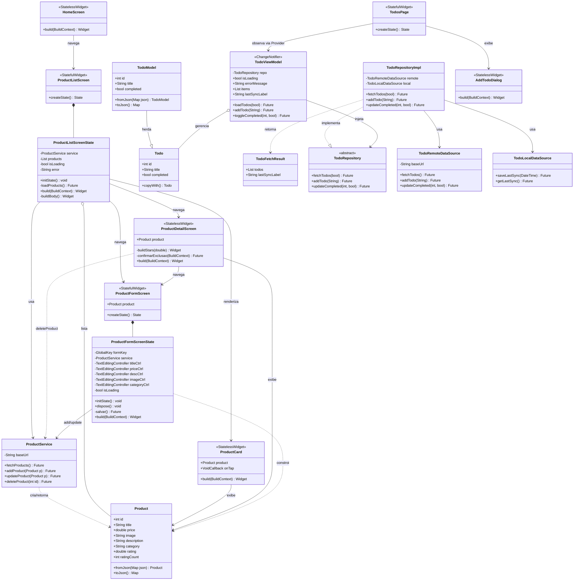

```mermaid
classDiagram
    direction TB

    %% ── MODELS ──────────────────────────────
    class Product {
        +int id
        +String title
        +double price
        +String image
        +String description
        +String category
        +double rating
        +int ratingCount
        +fromJson(Map json) Product
        +toJson() Map
    }

    %% ── SERVICES ─────────────────────────────
    class ProductService {
        -String baseUrl
        +fetchProducts() Future
        +addProduct(Product p) Future
        +updateProduct(Product p) Future
        +deleteProduct(int id) Future
    }

    %% ── SCREENS ──────────────────────────────
    class HomeScreen {
        <<StatelessWidget>>
        +build(BuildContext) Widget
    }

    class ProductListScreen {
        <<StatefulWidget>>
        +createState() State
    }

    class ProductListScreenState {
        -ProductService service
        -List products
        -bool isLoading
        -String error
        +initState() void
        -loadProducts() Future
        +build(BuildContext) Widget
        -buildBody() Widget
    }

    class ProductDetailScreen {
        <<StatelessWidget>>
        +Product product
        -buildStars(double) Widget
        -confirmarExclusao(BuildContext) Future
        +build(BuildContext) Widget
    }

    class ProductFormScreen {
        <<StatefulWidget>>
        +Product product
        +createState() State
    }

    class ProductFormScreenState {
        -GlobalKey formKey
        -ProductService service
        -TextEditingController titleCtrl
        -TextEditingController priceCtrl
        -TextEditingController descCtrl
        -TextEditingController imageCtrl
        -TextEditingController categoryCtrl
        -bool isLoading
        +initState() void
        +dispose() void
        -salvar() Future
        +build(BuildContext) Widget
    }

    %% ── WIDGETS ──────────────────────────────
    class ProductCard {
        <<StatelessWidget>>
        +Product product
        +VoidCallback onTap
        +build(BuildContext) Widget
    }

    %% ── TODOS DOMAIN ─────────────────────────
    class Todo {
        +int id
        +String title
        +bool completed
        +copyWith() Todo
    }

    class TodoFetchResult {
        +List todos
        +String lastSyncLabel
    }

    class TodoRepository {
        <<abstract>>
        +fetchTodos(bool) Future
        +addTodo(String) Future
        +updateCompleted(int, bool) Future
    }

    %% ── TODOS DATA ───────────────────────────
    class TodoModel {
        +int id
        +String title
        +bool completed
        +fromJson(Map json) TodoModel
        +toJson() Map
    }

    class TodoRepositoryImpl {
        -TodoRemoteDataSource remote
        -TodoLocalDataSource local
        +fetchTodos(bool) Future
        +addTodo(String) Future
        +updateCompleted(int, bool) Future
    }

    class TodoRemoteDataSource {
        -String baseUrl
        +fetchTodos() Future
        +addTodo(String) Future
        +updateCompleted(int, bool) Future
    }

    class TodoLocalDataSource {
        +saveLastSync(DateTime) Future
        +getLastSync() Future
    }

    %% ── TODOS PRESENTATION ───────────────────
    class TodoViewModel {
        <<ChangeNotifier>>
        -TodoRepository repo
        +bool isLoading
        +String errorMessage
        +List items
        +String lastSyncLabel
        +loadTodos(bool) Future
        +addTodo(String) Future
        +toggleCompleted(int, bool) Future
    }

    class TodosPage {
        <<StatefulWidget>>
        +createState() State
    }

    class AddTodoDialog {
        <<StatelessWidget>>
        +build(BuildContext) Widget
    }

    %% ── RELACIONAMENTOS: Products ─────────────
    ProductService ..> Product : cria/retorna

    ProductListScreen *-- ProductListScreenState
    ProductListScreenState --> ProductService : usa
    ProductListScreenState o-- Product : lista
    ProductListScreenState --> ProductCard : renderiza
    ProductListScreenState --> ProductDetailScreen : navega
    ProductListScreenState --> ProductFormScreen : navega

    ProductCard --> Product : exibe

    ProductDetailScreen --> Product : exibe
    ProductDetailScreen ..> ProductService : deleteProduct
    ProductDetailScreen --> ProductFormScreen : navega

    ProductFormScreen *-- ProductFormScreenState
    ProductFormScreenState --> ProductService : add/update
    ProductFormScreenState ..> Product : constroi

    HomeScreen --> ProductListScreen : navega

    %% ── RELACIONAMENTOS: Todos ────────────────
    TodoModel --|> Todo : herda

    TodoRepositoryImpl ..|> TodoRepository : implementa
    TodoRepositoryImpl --> TodoRemoteDataSource : usa
    TodoRepositoryImpl --> TodoLocalDataSource : usa
    TodoRepositoryImpl ..> TodoFetchResult : retorna

    TodoViewModel --> TodoRepository : injeta
    TodoViewModel o-- Todo : gerencia

    TodosPage --> TodoViewModel : observa via Provider
    TodosPage --> AddTodoDialog : exibe
```
